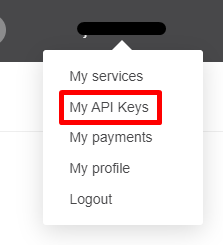
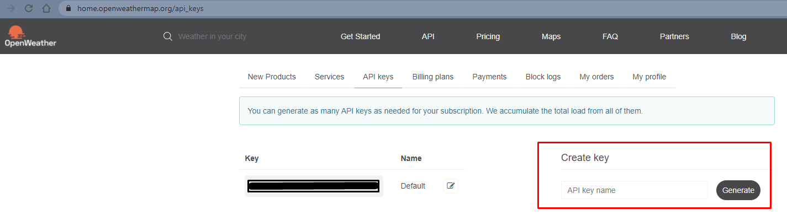
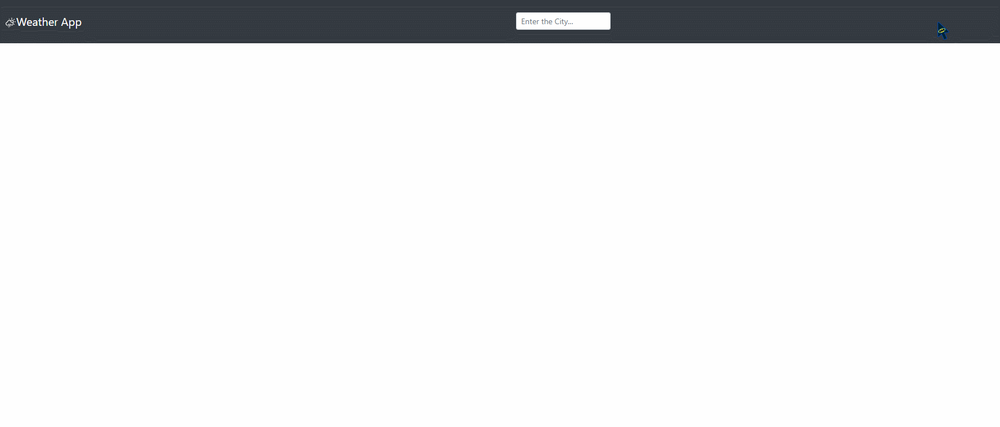
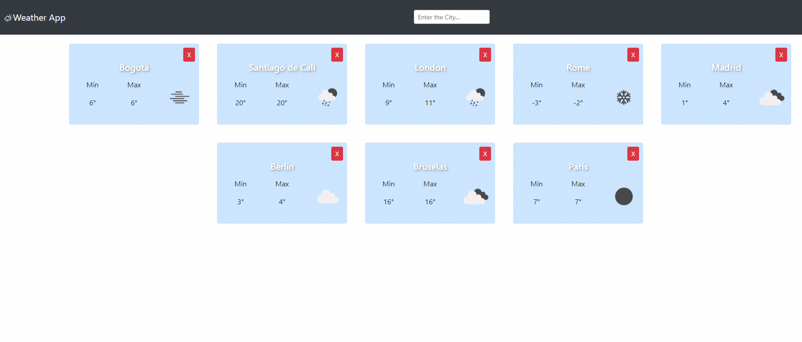
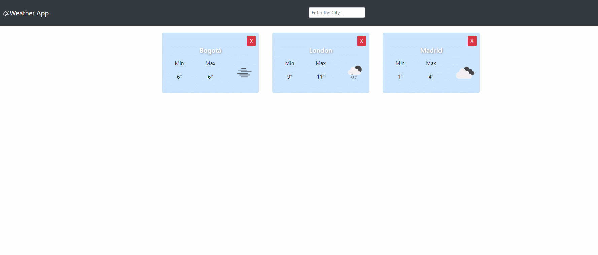
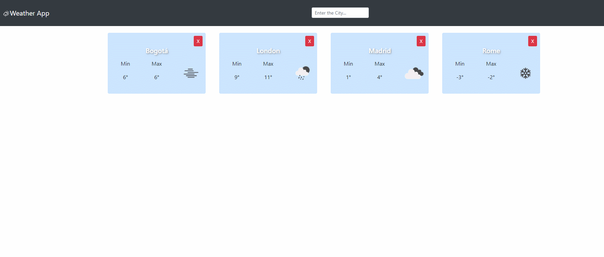

# Weather App

## Objetivo

Implementar Aplicacion del Clima usando API y desarrollar los conocimientos relacionados con JavaScript, CSS, React(Componentes Funcionales y Componentes de Clase).

### Notas Importantes antes de empezar

Antes de inicializar el proyecto se recomienda que en la carpeta principal del proyecto vas a tener que crear un archivo llamado: `.env` que tenga la siguiente forma:

```
REACT_APP_APIKEY=apikey
```
Tienes que reemplazar `apikey` con el codigo suministrado desde https://openweathermap.org/. Este archivo va ser ignorado por github, ya que contiene información sensible (las credenciales).


<p align="center" width="100%">
     
</p>



### Funcionamiento

Ubicarse en el directorio del proyecto y emitir desde la consola `npm install` parala instalacion de las dependencias necesarias

Al finalizar la instalacion de las dependencias emitir `npm start` para inicializar el proyecto

La aplicacion abrira [http://localhost:3000](http://localhost:3000) en el navegador.

**Adicionar Ciudades**



**Eliminar Ciudades**



**Ver Detalle de Ciudad**



**Manejo de Errores**

